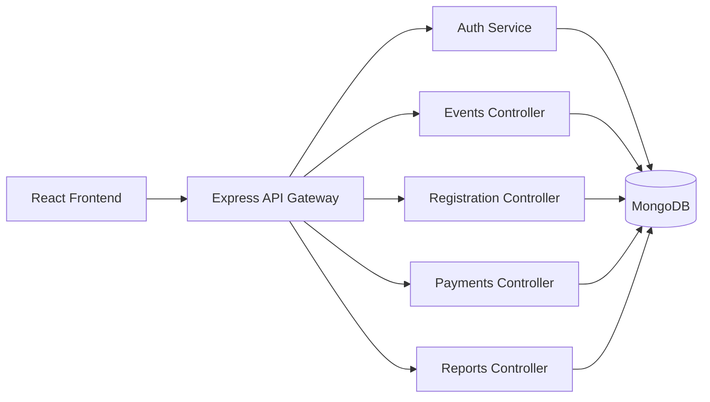

# 🎯 Eventhon — Enterprise Event Management Platform (MERN)

[](https://www.mongodb.com/)
[](https://nodejs.org/)
[](https://expressjs.com/)
[](https://react.dev/)
[](LICENSE)
[](https://vercel.com/)
[](https://render.com/)

---

## 🏗️ Overview

**Eventhon** is a full-featured **Event Management Platform** built with the **MERN stack** (MongoDB, Express, React, Node.js).  
It enables **Organizers** to host, manage, and approve events, while **Students** can browse, register, and pay for events.  
An **Admin panel** oversees event approvals, analytics, and reporting — streamlining campus and community event workflows.

---

## 🚀 Features

### 👨‍💼 Organizers
- Create, edit, and manage event drafts  
- Submit events for admin approval  
- Track participant registrations and payments  
- Export registration reports (CSV / PDF)

### 🎓 Students
- Explore and filter published events  
- Register and pay securely  
- Withdraw or view registered events  
- Receive automated confirmation emails

### 🧑‍⚖️ Admins
- Review and approve event submissions  
- Publish or close events  
- Manage organizers and view system logs  
- Generate performance and participation reports  

### ⚙️ Platform-Wide
- JWT-based Authentication & Authorization (cookie-based sessions)  
- RESTful API architecture  
- Responsive UI with glassmorphism + TailwindCSS  
- Secure routes & input validations  
- Real-time updates for registration and approvals  
- Scalable backend (MongoDB Replica-ready)

---

## 🧠 System Architecture



---

## 🧰 Tech Stack

| Layer | Technologies |
|-------|---------------|
| **Frontend** | React.js, Vite, TailwindCSS, React Query, Axios |
| **Backend** | Node.js, Express.js, REST APIs, JWT Auth |
| **Database** | MongoDB (Mongoose ORM) |
| **Payments & Reports** | Stripe/Razorpay (mock), CSV exports |
| **Version Control** | Git + GitHub |
| **Testing & API Tools** | Postman, Thunder Client |
| **Deployment** | Backend: Render • Frontend: Vercel |

---

## 🖼️ UI Previews

| Home Page | Organizer Dashboard | Admin Dashboard |
|------------|---------------------|-----------------|
|  |  |  |

---

## ⚡ Installation & Setup

### 1️⃣ Clone the Repository
```bash
git clone https://github.com/yourusername/eventsphere.git
cd eventsphere
```

### 2️⃣ Backend Setup
```bash
cd server
npm install
npm run dev
```

Create a `.env` file inside `/server`:
```env
PORT=4000
MONGO_URI=your_mongodb_uri
JWT_SECRET=your_secret_key
CORS_ORIGIN=http://localhost:5173
```

### 3️⃣ Frontend Setup
```bash
cd ../frontend
npm install
npm run dev
```

Frontend runs on `http://localhost:5173`  
Backend runs on `http://localhost:4000`

---

## 🔐 Authentication Flow

| Action | Endpoint | Role |
|--------|-----------|------|
| Register | `/api/auth/register` | Student/Organizer |
| Login | `/api/auth/login` | All |
| Auth Check | `/api/auth/me` | All |
| Logout | `/api/auth/logout` | All |

---

## 🧾 License

This project is open-source and available under the [MIT License](LICENSE).

---

### 💡 Developed by: **Lakshmidhar Santimalla**
> “Streamlining event workflows through scalable full-stack innovation.”
